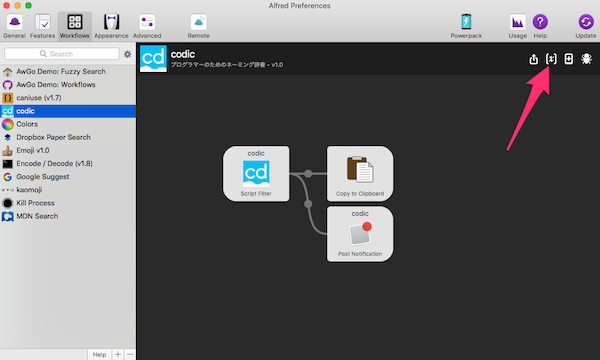
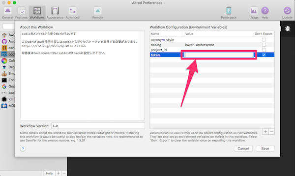

# alfred3-codic-workflow

[codic.jp](https://codic.jp/)をAlfredから使うWorkflowです

このWorkflowを使用するには[codic.jp](https://codic.jp/docs/api#limitation)からアクセストークンを取得する必要があります。

取得後はEnvironmentVariablesのtokenに設定して下さい。

[Download](https://github.com/hirosan18/alfred3-codic-workflow/releases)

## アクセストークンの設定

